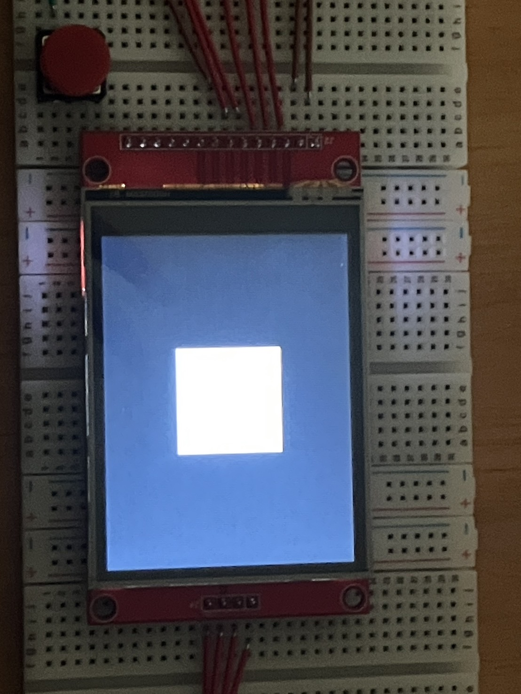
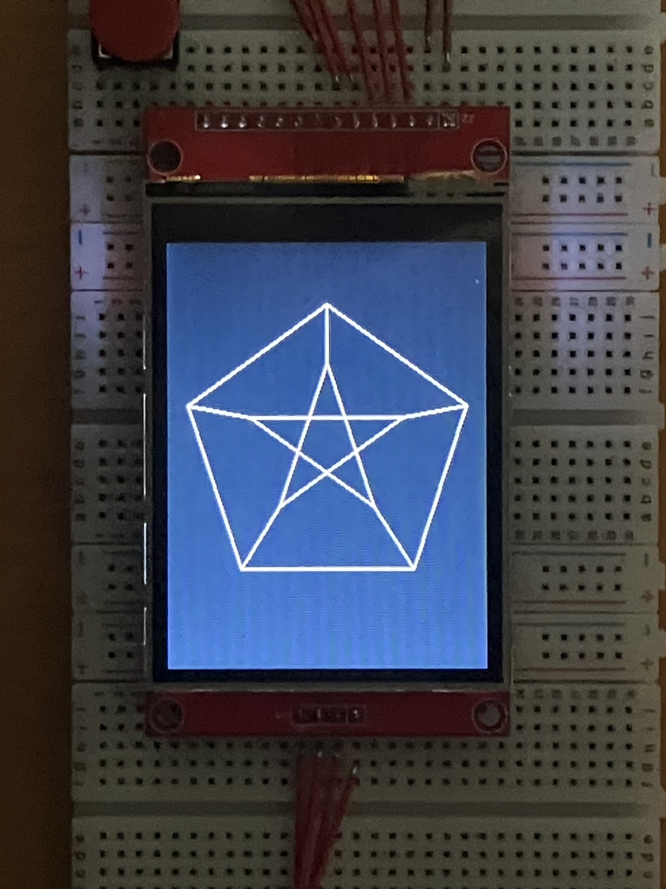
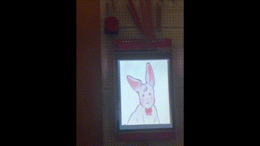

# RaspberryPi-SPI-Display

このプロジェクトは、 **Raspberry Pi Pico** を使用して、**MSP2807** とSPI通信を行うものです。

## ファイル構成
このプロジェクトの主要なディレクトリとファイルの構成について説明します。

### draw_square/
- **概要**: 正方形を描画するための実装が含まれています。
- **主なファイル**
  - main.py : mainスクリプト
  - ili9341_init.py : 初期化を行う
  - ili9341_clear.py : クリア（画面を黒く塗りつぶす）を行う
  - square.py : 四角形の描画を行う

### draw_petersen_graph/
- **概要**: ペテルセングラフを描画するための実装が含まれています。
- **主なファイル**
  - main.py : mainスクリプト
  - ili9341_init.py : 初期化を行う
  - ili9341_clear.py : クリア（画面を黒く塗りつぶす）を行う
  - petersen_graph.py :　ペテルセングラフの描画を行う 

### draw_picture/
- **概要**: 画像を描画するための実装が含まれています。
- **主なファイル**
  - data/ : 表示する画像、画像処理のコードを格納
  - main.py : mainスクリプト
  - ili9341.py : 画像の描画を行う

## 実装内容とコード

### ディスプレイに正方形を描画
- `draw_square/` ディレクトリ に実装されています。

白色の正方形をディスプレイに描画した様子を以下に示します。

  

### ディスプレイにペテルセングラフを描画
- `draw_petersen_graph/` ディレクトリ に実装されています。

白色のペテルセングラフをディスプレイに描画した様子を以下に示します。

  

### ディスプレイに画像を描画
- `draw_picture/` ディレクトリ に実装されています。

画像をディスプレイに描画した様子を以下に示します。ボタンを押すことで、画像を切り替えることができます。

`draw_picture/data/` に格納されている画像は `main.py` と同じディレクトリに格納してください。

  

## 参考
このプロジェクトでは、コマンドおよびデータ送信のタイミングの参考として、
MITライセンスで公開されている [rdagger/micropython-ili9341](https://github.com/rdagger/micropython-ili9341) の ili9341.py を参考にしつつ、本プロジェクト用に一部改変を行っています。

参考および改変したファイルは以下の通りです：
- draw_square/ili9341_init.py
- draw_square/ili9341_clear.py
- draw_square/square.py
- draw_petersen_graph/ili9341_init.py
- draw_petersen_graph/ili9341_clear.py
- draw_petersen_graph/petersen_graph.py
- draw_picture/ili9341.py
